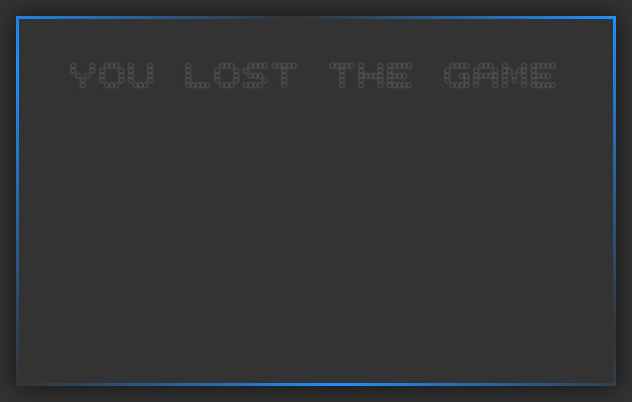

# Number-Guessing-Game

The number guessing game sets a random number from 1 to 100.

If the entered number is larger or smaller, the respective message is displayed.

If you can't find the number after ten tries, you lose the game

